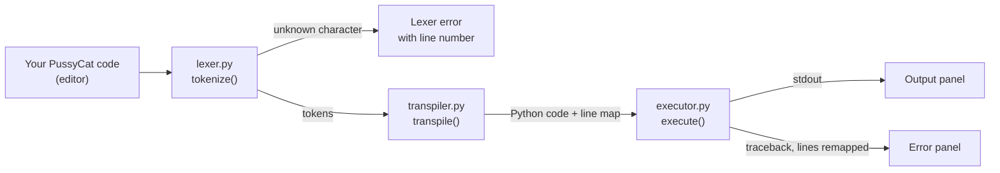

# PussyCat — Team Demo Guide

A short guide for presenting PussyCat. Everything here was checked against the code and a real run.

## 1. The 30-second pitch

> PussyCat is our own programming language where Python's keywords are replaced by cat sounds
> (`meow` = `if`, `nyan` = `print`). We built a desktop IDE for it: you type PussyCat, the app
> translates it to Python, runs it, and shows you the output. If something breaks, the error
> points at **your** line in PussyCat, not a line in generated Python.

PussyCat is a *transpiled* language: it is translated into Python, then Python runs it. We did not
write an interpreter or a compiler to machine code.

## 2. How it works



| Stage | File | What it does | Input → Output |
|-------|------|--------------|----------------|
| Lexer | [lexer.py](../lexer.py) | Splits source into tokens (keyword, identifier, number, string, symbol, whitespace, comment). Rejects characters PussyCat doesn't know, like `$`. | text → tokens, or an error with a line number |
| Transpiler | [transpiler.py](../transpiler.py) | Replaces each keyword token using `KEYWORD_MAP`; copies everything else as is. Records which Python line came from which PussyCat line. | tokens → Python text + line map |
| Executor | [executor.py](../executor.py) | Writes the Python to a temp file, runs it with a 10-second timeout, captures output, rewrites line numbers in errors using the line map. | Python + line map → stdout / error |
| GUI | [gui.py](../gui.py) | tkinter window that wires the three stages together. | |
| Keywords | [constants.py](../constants.py) | `KEYWORD_MAP`, the single source of truth for the language. | |

### One program, followed through every stage

PussyCat source (5 lines):

```
trick greet(name):
    furball "Meow, " + name

nyan(greet("Rem"))
nyan(1 / 0)
```

1. **Lexer** produces tokens such as `KEYWORD trick`, `IDENT greet`, `SYMBOL (`, each tagged with its line.
2. **Transpiler** produces:
   ```python
   def greet(name):
       return "Meow, " + name

   print(greet("Rem"))
   print(1 / 0)
   ```
   with a line map `{1: 1, 2: 2, 3: 3, 4: 4, 5: 5, 6: 6}`. The map is one-to-one because keywords are
   swapped in place and no lines are added or removed. It exists so errors can be traced back even if that changes.
3. **Executor** runs it. Output `Meow, Rem`, then Python raises `ZeroDivisionError` at its line 5,
   which the line map turns into PussyCat line 5.

> Gotcha: the error text shows the generated code line (`print(1 / 0)`) under the remapped line
> number, because Python prints the source line it ran. The *number* is remapped; the echoed code is Python.

## 3. The language in one table

| Group | PussyCat → Python |
|-------|-------------------|
| Control flow | `meow`→`if`, `mew`→`else`, `chase`→`while`, `paws`→`for` |
| Values and logic | `purr`→`True`, `hiss`→`False`, `box`→`None`, `whiskers`→`and`, `tail`→`or`, `scratch`→`not` |
| Functions and classes | `trick`→`def`, `furball`→`return`, `breed`→`class` |
| Errors | `pounce`→`try`, `miss`→`except`, `nap`→`finally` |
| Imports and output | `adopt`→`import`, `shelter`→`from`, `nyan`→`print` |
| Data types | `mrow`→`int`, `mrrp`→`float`, `yowl`→`str`, `chirp`→`bool`, `chatter`→`list`, `trill`→`tuple`, `squeal`→`set`, `growl`→`dict` |

27 keywords in total. Anything else is ordinary Python, so `range`, `len`, `input` and so on work as they do in Python.
In the IDE, the **📖 Keywords** button opens this table as a popup.

## 4. Live demo script (about 5 minutes)

Start with `python3 main.py`. Sample programs live in [examples/](../examples/); paste them into the editor.

| # | Do this | Say this |
|---|---------|----------|
| 1 | Launch the app. | "The splash plays first, then the main window appears." |
| 2 | Click **📖 Keywords**. | "Quick lookup so nobody memorizes the language." Close it with Esc. |
| 3 | Paste `examples/hello.cat`, press **Ctrl+Enter**. | "Top panel is the Python we generated, below it is the program output. Status bar goes green." |
| 4 | Paste `examples/loops.cat`, run. | "`paws` is a for loop, `meow`/`mew` is if/else, `chase` is while. The generated Python is shown so you can compare." |
| 5 | Paste `examples/tricks.cat`, run. | "Functions, classes, and try/except/finally, all in cat words." |
| 6 | Type a line containing `$`, run. | "The lexer stops before anything runs and tells us the line." (red error) |
| 7 | Paste `examples/error_demo.cat`, run. | "This crashes at runtime. The error says line 4, which is the line in our PussyCat code." |
| 8 | Click **🗑 Clear**. | "Resets the editor and output." |

Why the order works: it goes from the simplest success, through richer programs, to the two kinds of
failure, which is where the line-number remapping is the interesting part.

## 5. Likely questions

**Why transpile to Python instead of writing an interpreter?**
It reuses Python's runtime. Our work focuses on the language front end (tokens, keyword mapping,
error mapping). The trade-off: PussyCat inherits Python's behavior and speed.

**How do the error line numbers get fixed?**
The transpiler records, for each generated Python line, the PussyCat line it came from. The
executor then rewrites `line N` in Python's traceback using that map. See `_remap_traceback` in [executor.py](../executor.py).

**What if the program never ends?**
The executor kills it after 10 seconds and reports a timeout (`EXECUTION_TIMEOUT` in [executor.py](../executor.py)).

**Is it safe to run anything?**
No. Code runs as a normal Python subprocess with your user's permissions. It is a learning tool;
only run code you trust.

**Can I name a variable `meow`?**
No. Keywords are reserved everywhere outside strings and comments, so `meow` becomes `if`. A keyword
inside a string, like `nyan("meow")`, is left alone. This is a known limitation of a simple token-swap design.

**Why isn't there syntax highlighting, file saving, or multiple files?**
They are listed as non-goals for v1 in [the PRD](PRD-PussyCat.md).

**How do we know it works?**
Run the tests (section 6). They cover each stage, the full pipeline, the timeout, the GUI, and every sample program.

## 6. Before you present (checklist)

- [ ] `python3 --version` shows 3.10 or newer.
- [ ] `python3 -c "import tkinter"` runs without error. On Debian/Ubuntu: `sudo apt install python3-tk`.
- [ ] `python3 -m unittest discover tests` ends with `OK`. (The GUI tests need a display and skip themselves without one.)
- [ ] `python3 main.py` opens the splash, then the main window.
- [ ] Run each file in `examples/` once on the presenting machine.
- [ ] Have `examples/*.cat` open in another window, ready to copy.
- [ ] Practice step 6 and step 7: the error cases are the part people remember.

## 7. Where to look for more

| Question | Document |
|----------|----------|
| What are we building and for whom? | [PRD-PussyCat.md](PRD-PussyCat.md) |
| Exact behavior and edge cases | [SPEC-PussyCat.md](SPEC-PussyCat.md) |
| Look and feel | [DESIGN.md](DESIGN.md) |
| What was built in which sprint | [Sprints-Overview.md](Sprints-Overview.md) |
